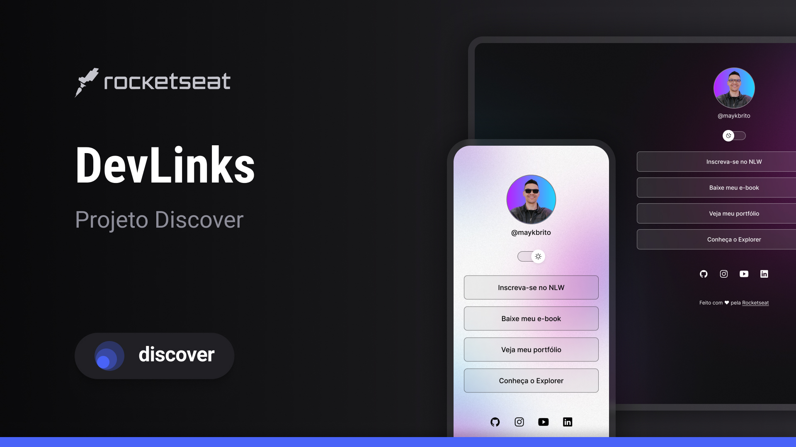

# Projeto "DevLinks"

Em tese este é o meu segundo projeto, agora publicado com uma pequena introdução de *JavaScrips, HTML e CSS*.  

Trata-se do *Projeto DevLinks*, baseado nos estudos da *Rocketseat*, que tem como objetivo criar um *agregador de links*.

É Uma pagina de autoapresentação *um cartão de visitas digital*, moderna, responsiva e com potencial para novas interatividades. 🚀

---

- **Meu cartão de visitas**
Você pode acessar o projeto publicado aqui:  

👉 https://daniel-nascimento-13.github.io/Dev-Links/

- **Layout do projeto**
Você pode acessar o layout do projeto aqui: 

👉 https://www.figma.com/design/8dNQfUkM25PwuiDis3L2l6/DevLinks-•-Projeto-Discover--Community-?node-id=1437-191&m=dev

*É necessário ter conta no [Figma](https://figma.com) para acessá-lo.*

  

---

**Tecnologias utilizadas**
- HTML5  
- CSS3  
- JAVASCRIPT
- FIGMA

